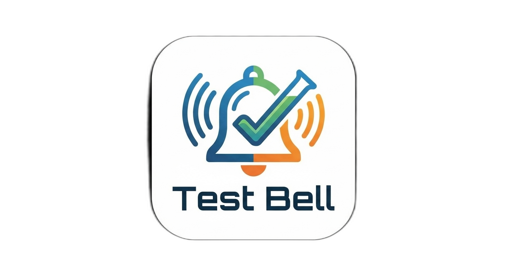

# Test Bell

[](https://marketplace.visualstudio.com/items?itemName=jflbr.test-bell)


<p align="center">
  
</p>

A VS Code extension that plays a sound when a test run fails, and optionally when all tests pass.

## Features

- Plays an audio alert when any test in a test run fails
- Optional sound on test success
- Cross-platform: macOS, Linux, and Windows
- Supports `.wav` and `.mp3` audio files
- Customizable fail and pass sounds

## How It Works

Test Bell detects test runs from multiple sources:

- **Terminal commands** — Automatically recognizes test runners (`pytest`, `npm test`, `jest`, `go test`, `cargo test`, etc.) and test file naming conventions (`test_*.py`, `*.test.js`, `*.spec.ts`, etc.) run in the integrated terminal
- **VS Code Tasks** — Catches tasks with the `test` group or "test" in the task name from `tasks.json`
- **Testing UI sidebar** — Supports the VS Code Test Explorer (requires opt-in, see [below](#testing-ui-support))


### Testing UI Support

The VS Code Testing UI (sidebar, inline "Run Test" buttons) uses a proposed API that isn't yet stable. Test Bell can use it, but you need to opt in.

Alternatively, you can pass the flag when launching from the terminal (applies to that session only):

```bash
code --enable-proposed-api jflbr.test-bell
```

Without this, Test Bell still works for terminal-based and task-based test runs.

**Alternatively**, open the Command Palette and run **Preferences: Configure Runtime Arguments** (this opens `~/.vscode/argv.json`), then add:

```jsonc
{
  "enable-proposed-api": ["jflbr.test-bell"]
}
```

You can also edit `~/.vscode/argv.json` directly. Restart VS Code for the change to take effect. This persists across all launch methods (dock icon, `code` CLI, file associations).

To disable it, remove the entry from the array and restart.

## Configuration

| Setting | Type | Default | Description |
|---|---|---|---|
| `testBell.enabled` | boolean | `true` | Enable or disable the test bell |
| `testBell.playOnSuccess` | boolean | `true` | Play a sound when all tests pass |
| `testBell.volume` | number | `1` | Volume level (macOS only, via `afplay -v`) |
| `testBell.failSound` | string | `""` | Custom audio file for failures |
| `testBell.passSound` | string | `""` | Custom audio file for passes |

## Custom Sounds

You can specify custom `.wav` or `.mp3` files for the fail and pass sounds.

### Absolute path

```json
{
  "testBell.failSound": "/Users/me/sounds/buzzer.wav"
}
```

### Relative to workspace root

```json
{
  "testBell.failSound": "sounds/fail-horn.mp3"
}
```

If the file doesn't exist or the format is unsupported, the extension falls back to the bundled default sound and shows a one-time warning.

### Finding sounds

You can find a wide variety of sound effects at [myinstants.com](https://www.myinstants.com/). Download an `.mp3` or `.wav` file, place it in your project or anywhere on disk, and point the config to it.

## Platform Audio Support

| Platform | `.wav` | `.mp3` |
|---|---|---|
| macOS | `afplay` | `afplay` |
| Linux | `aplay` | `mpg123` |
| Windows | PowerShell `SoundPlayer` | `wmplayer` |
