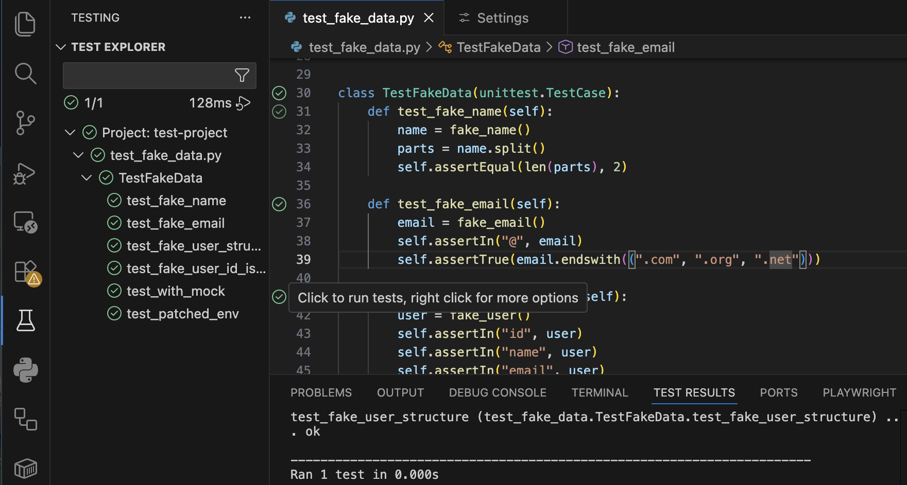

# Test Bell

A VS Code extension that plays a sound when a test run fails, and optionally when all tests pass.

## Features

- Plays an audio alert when any test in a test run fails
- Optional sound on test success
- Cross-platform: macOS, Linux, and Windows
- Supports `.wav` and `.mp3` audio files
- Customizable fail and pass sounds

## How It Works

Run your tests from the VS Code Test Explorer. Test Bell listens for results and plays a sound when any test fails. The example below shows Python tests using the `unittest` module, but it works with any test framework that integrates with VS Code's Test Explorer (pytest, Jest, Vitest, Go tests, etc.).



## Configuration

| Setting | Type | Default | Description |
|---|---|---|---|
| `testBell.enabled` | boolean | `true` | Enable or disable the test bell |
| `testBell.playOnSuccess` | boolean | `false` | Play a sound when all tests pass |
| `testBell.volume` | number | `1` | Volume level (macOS only, via `afplay -v`) |
| `testBell.failSound` | string | `""` | Custom audio file for failures |
| `testBell.passSound` | string | `""` | Custom audio file for passes |

## Custom Sounds

You can specify custom `.wav` or `.mp3` files for the fail and pass sounds.

### Absolute path

```json
{
  "testBell.failSound": "/Users/me/sounds/buzzer.wav"
}
```

### Relative to workspace root

```json
{
  "testBell.failSound": "sounds/fail-horn.mp3"
}
```

If the file doesn't exist or the format is unsupported, the extension falls back to the bundled default sound and shows a one-time warning.

### Finding sounds

You can find a wide variety of sound effects at [myinstants.com](https://www.myinstants.com/). Download an `.mp3` or `.wav` file, place it in your project or anywhere on disk, and point the config to it.

## Platform Audio Support

| Platform | `.wav` | `.mp3` |
|---|---|---|
| macOS | `afplay` | `afplay` |
| Linux | `aplay` | `mpg123` |
| Windows | PowerShell `SoundPlayer` | `wmplayer` |
